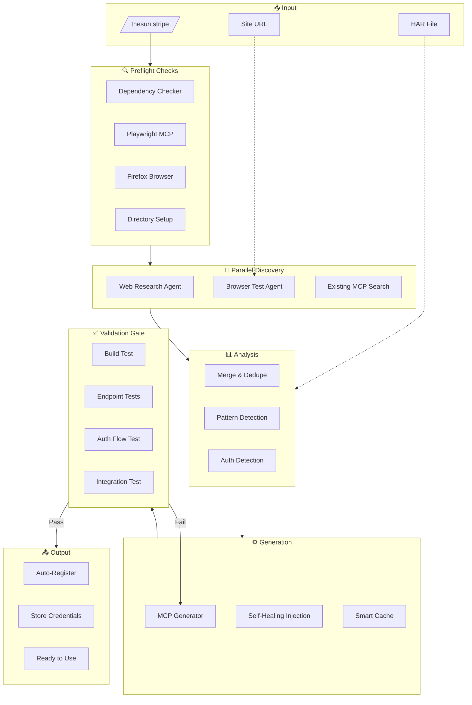
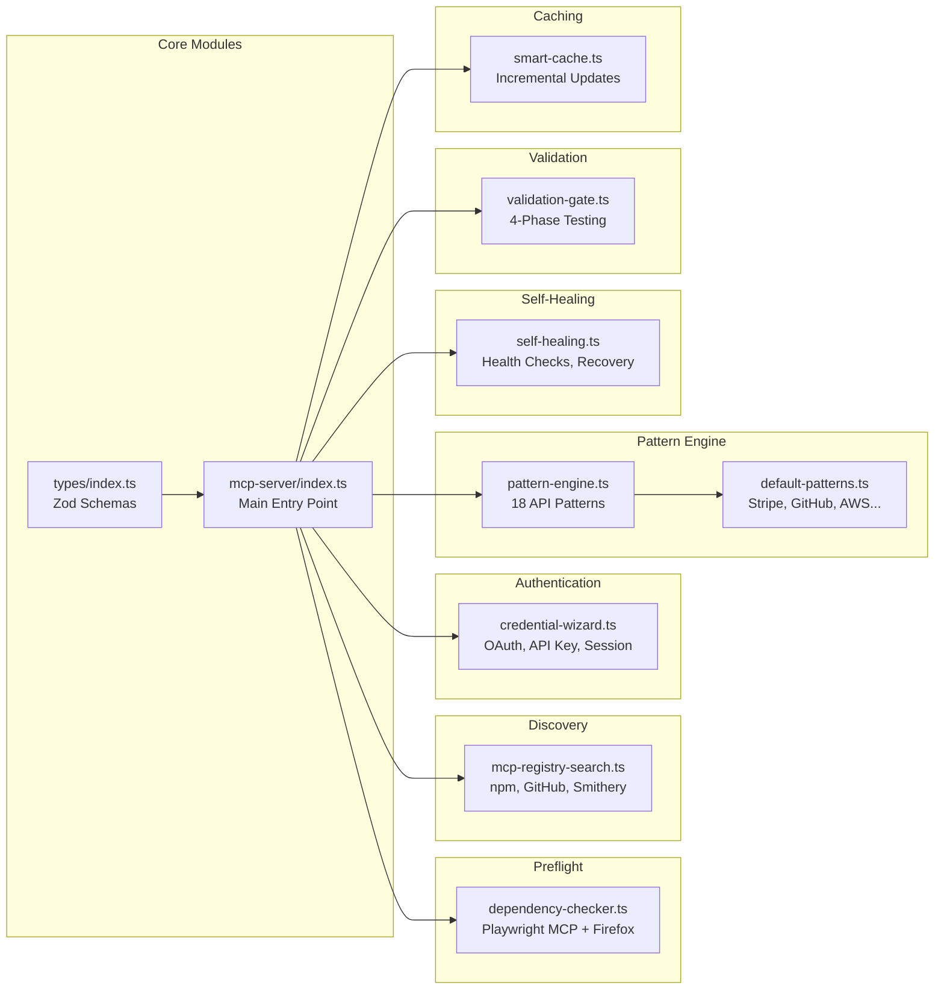
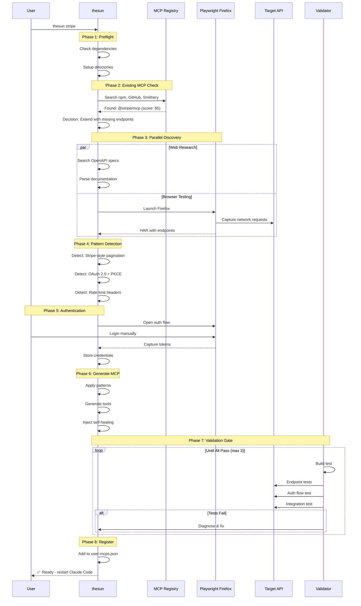
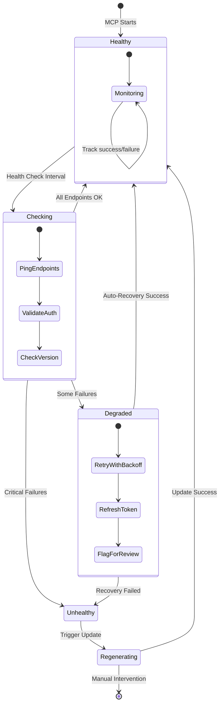
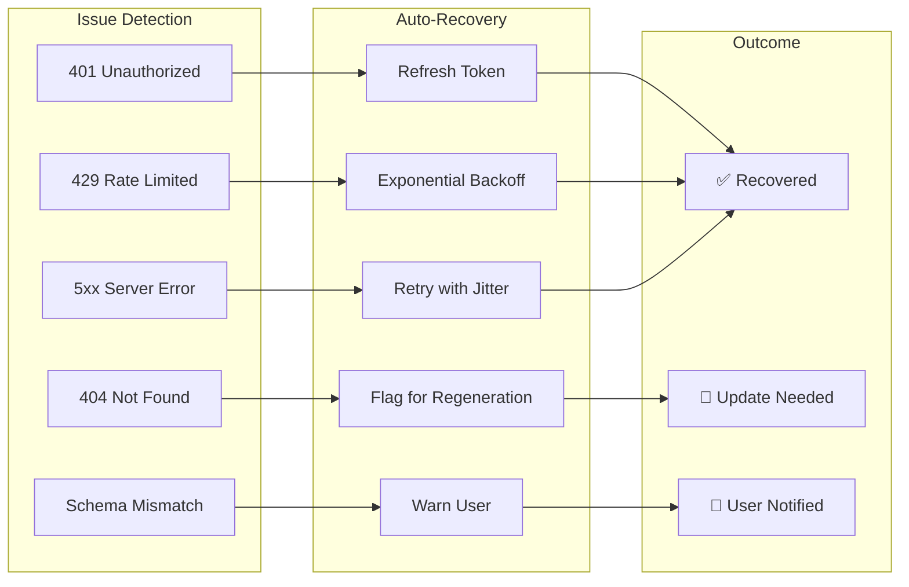
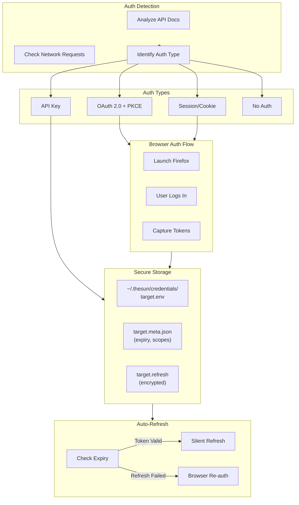
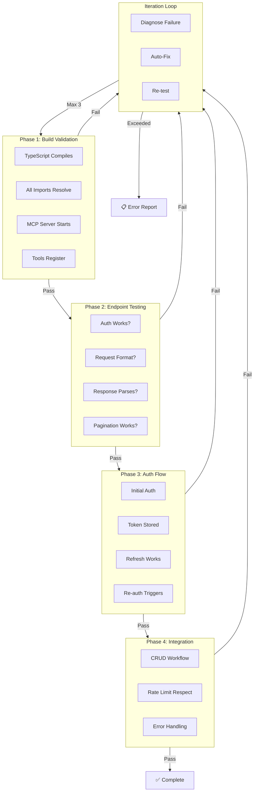
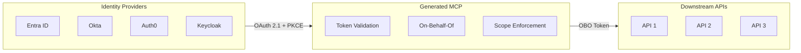

<p align="center">
  
</p>

<h1 align="center">thesun</h1>

<p align="center">
  <strong>Autonomous MCP Server Generation Platform</strong>
</p>

<p align="center">
  <a href="#features"></a>
  <a href="#"></a>
  <a href="#"></a>
  <a href="#"></a>
  <a href="#"></a>
</p>

<p align="center">
  <a href="#quick-start">Quick Start</a> •
  <a href="#features">Features</a> •
  <a href="#architecture">Architecture</a> •
  <a href="#how-it-works">How It Works</a> •
  <a href="#security">Security</a>
</p>

---

## What is thesun?

**thesun** is a security-first, autonomous platform that generates production-ready [MCP (Model Context Protocol)](https://modelcontextprotocol.io/) servers with near-zero human involvement. Given any API, it:

1. **Discovers** all endpoints via web research, OpenAPI specs, and browser automation
2. **Generates** complete TypeScript MCP server with proper auth, error handling, and rate limiting
3. **Validates** every tool against the live API before declaring done
4. **Self-heals** by detecting API changes and regenerating affected endpoints
5. **Registers** globally for immediate use in Claude, Copilot, Gemini, and Codex

```bash
# That's it. One command.
thesun stripe
```

---

## Features

<table>
<tr>
<td width="50%">

### Zero-Config Generation

Single command generates complete, working MCP. Auth type, pagination style, rate limits - all auto-detected.

```bash
thesun stripe           # Full generation
thesun stripe --har ~/f # Skip browser discovery
thesun stripe --update  # Refresh existing MCP
thesun stripe --fix     # Quick patch
```

</td>
<td width="50%">

### Perfect First Run

Every tool validated against the live API before completion. No more "it builds but doesn't work."

```
✅ MCP Generation Complete

stripe-mcp v1.0.0
├─ 47 tools generated
├─ 47/47 validated against live API
├─ Auth: OAuth 2.0 + PKCE (token saved)
└─ Self-healing: enabled
```

</td>
</tr>
<tr>
<td width="50%">

### Browser-Based Discovery

Reverse-engineer undocumented APIs by capturing network traffic and tokens via **Playwright MCP + Firefox**. Full localStorage, sessionStorage, and cookie access.

</td>
<td width="50%">

### Cross-Platform Compatible

Generated MCPs work with:

- Claude Code
- GitHub Copilot
- Google Gemini
- OpenAI Codex

</td>
</tr>
<tr>
<td width="50%">

### Self-Healing MCPs

Health monitoring detects API drift, deprecated endpoints, and auth failures - automatically triggering fixes.

</td>
<td width="50%">

### Smart Caching

Incremental updates only regenerate changed endpoints. User modifications preserved across updates.

</td>
</tr>
</table>

---

## Architecture

### High-Level System Design



### Module Architecture



---

## How It Works

### Generation Pipeline



### Self-Healing System



### Auto-Recovery Actions



---

## Credential Wizard

### Authentication Flow



---

## Pattern Detection

### Supported Patterns

| Pattern     | Detection            | Applied Features                        |
| ----------- | -------------------- | --------------------------------------- |
| **Stripe**  | `X-Stripe-*` headers | Idempotency, expand params, pagination  |
| **GitHub**  | `X-GitHub-*` headers | GraphQL + REST, rate limits, pagination |
| **AWS**     | Signature v4         | Regional endpoints, retry logic         |
| **Shopify** | GraphQL cursor       | Bulk operations, webhooks               |
| **Twilio**  | Basic auth           | Pagination, media handling              |
| **Slack**   | `X-Slack-*` headers  | Socket mode, rate limits                |

```mermaid
flowchart LR
    subgraph Input["API Response"]
        HEADERS["Response Headers"]
        BODY["Response Body"]
        ERRORS["Error Format"]
    end

    subgraph Detection["Pattern Matcher"]
        PAGINATION["Pagination Style<br/>cursor/offset/page/link"]
        RATELIMIT["Rate Limiting<br/>X-RateLimit-*/Retry-After"]
        ERRORFORMAT["Error Format<br/>stripe/rfc7807/simple"]
        AUTHSTYLE["Auth Style<br/>Bearer/X-API-Key/custom"]
    end

    subgraph Patterns["Known Patterns"]
        P1["stripe.pattern.json"]
        P2["github.pattern.json"]
        P3["aws.pattern.json"]
        P4["shopify.pattern.json"]
    end

    subgraph Apply["Applied Features"]
        RETRY["Retry Logic"]
        BACKOFF["Backoff Strategy"]
        IDEM["Idempotency"]
        WEBHOOKS["Webhook Validation"]
    end

    Input --> Detection
    Detection --> Patterns
    Patterns --> Apply
```



---

## Validation Gate

### Four-Phase Testing



---

## Quick Start

### Prerequisites

- Node.js 18+
- Firefox browser (for browser-based token capture)
- Playwright MCP (Claude plugin or manual install with `--browser firefox`)

### Installation

```bash
# Clone repository
git clone https://github.com/schwarztim/thesun.git
cd thesun

# Install dependencies
npm install

# Build
npm run build
```

### Usage

```bash
# Generate MCP for any API
thesun stripe

# With HAR file (skip browser discovery)
thesun stripe --har ~/Downloads/stripe.har

# Update existing MCP
thesun stripe --update

# Quick fix broken MCP
thesun stripe --fix

# Force full regeneration
thesun stripe --no-cache
```

### As Claude Code Plugin

```bash
# Generate an MCP server
/sun dynatrace

# Check build status
/sun-status
```

---

## Security

### MCP Authorization Specification

All generated MCPs follow [OAuth 2.1](https://oauth.net/2.1/) with enterprise-grade security:

| Requirement                   | Type     | Implementation                         |
| ----------------------------- | -------- | -------------------------------------- |
| **NO Token Passthrough**      | MUST NOT | Tokens never passed to downstream APIs |
| **NO Session Auth**           | MUST NOT | Sessions for state only                |
| **Token Audience Validation** | MUST     | RFC 8707 validation                    |
| **PKCE Required**             | MUST     | S256 code challenge                    |
| **Short-lived Tokens**        | SHOULD   | 15-30 min with refresh                 |

### Identity Providers



---

## Directory Structure

```
~/.thesun/
├── credentials/          # Secure credential storage
│   ├── stripe.env       # API keys, tokens
│   ├── stripe.refresh   # Encrypted refresh token
│   └── stripe.meta.json # Expiry, scopes
├── cache/               # Smart caching
│   └── stripe/
│       ├── openapi.json # Downloaded spec
│       ├── openapi.hash # SHA256 for diff
│       └── generated/   # Last generated source
├── health/              # Health monitoring
│   └── stripe/
│       ├── health.log   # Success/failure log
│       └── schema-drift.json
└── patterns/            # API pattern library
    ├── stripe.pattern.json
    ├── github.pattern.json
    └── aws.pattern.json
```

---

## Testing

```bash
# Run all tests
npm test

# Run with coverage
npm run test:coverage

# Run specific module tests
npm test -- src/preflight
npm test -- src/validation
```

**Current Status:** 234 tests passing across 9 test files.

---

## Technology Stack

| Category       | Technology                |
| -------------- | ------------------------- |
| **Language**   | TypeScript (strict mode)  |
| **Runtime**    | Node.js 18+               |
| **Testing**    | Vitest                    |
| **Validation** | Zod                       |
| **Logging**    | Winston                   |
| **Build**      | TSC with ESM              |
| **Protocol**   | @modelcontextprotocol/sdk |

---

## Roadmap

- [ ] GraphQL support
- [ ] WebSocket tool generation
- [ ] Multi-tenant credential isolation
- [ ] Kubernetes operator for MCP lifecycle
- [ ] Visual MCP builder UI

---

## License

Proprietary - Internal use only.

---

<p align="center">
  <sub>Built with ❤️ for autonomous AI tooling</sub>
</p>
