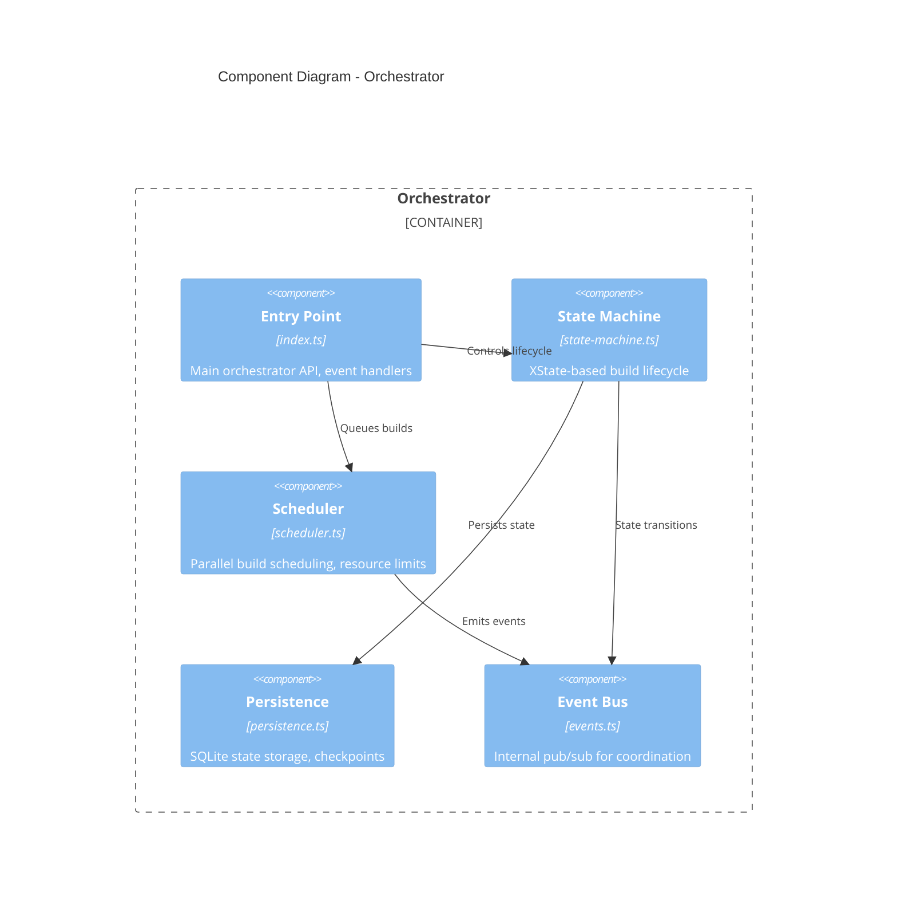
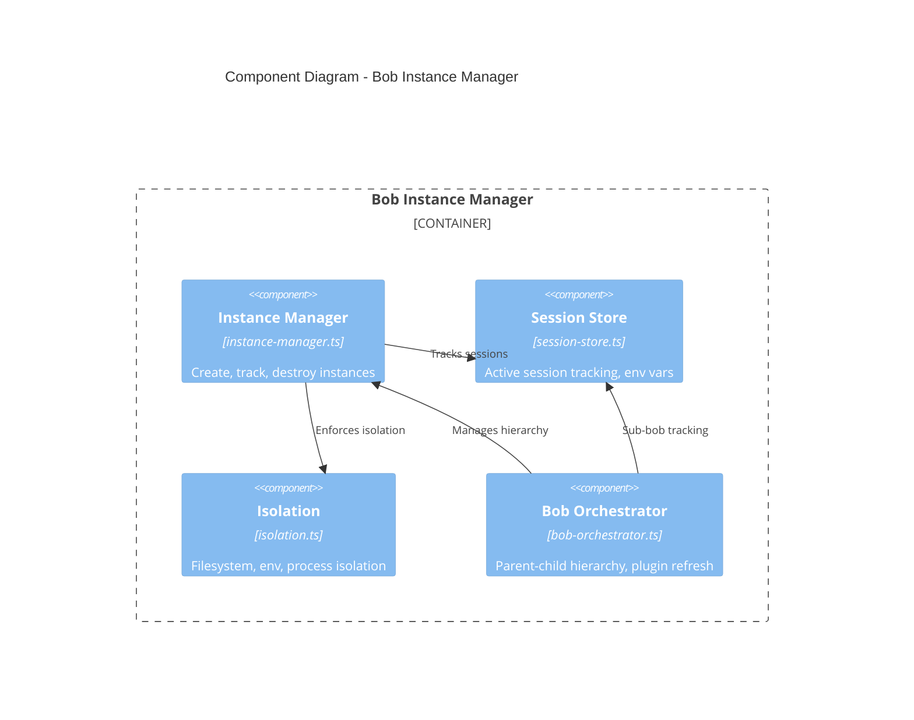
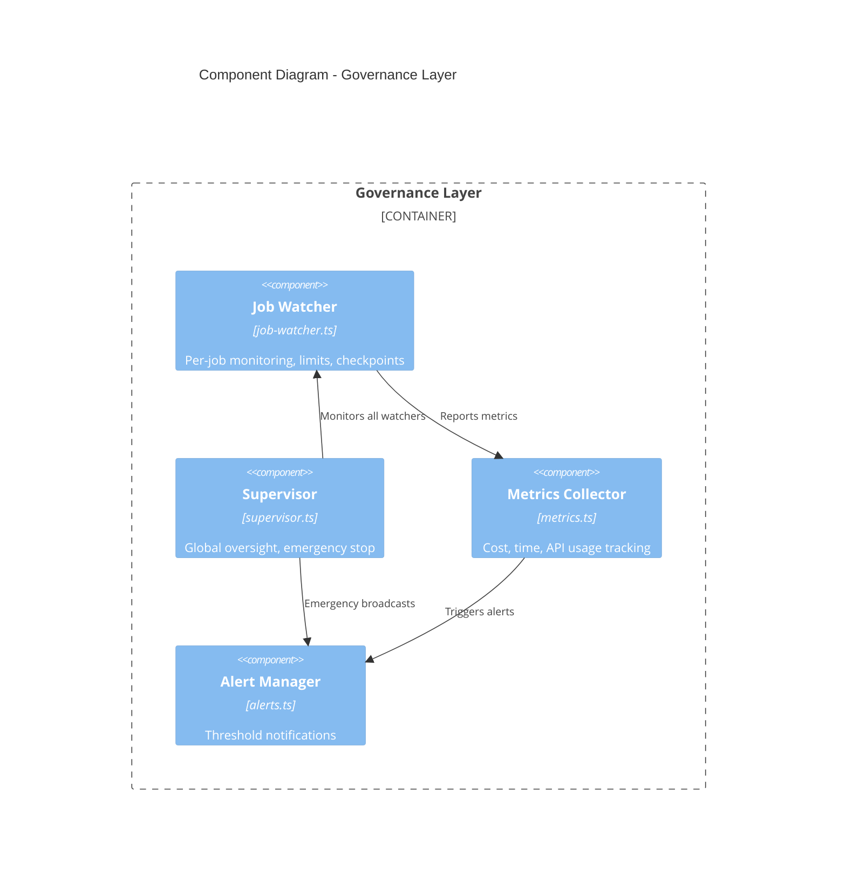
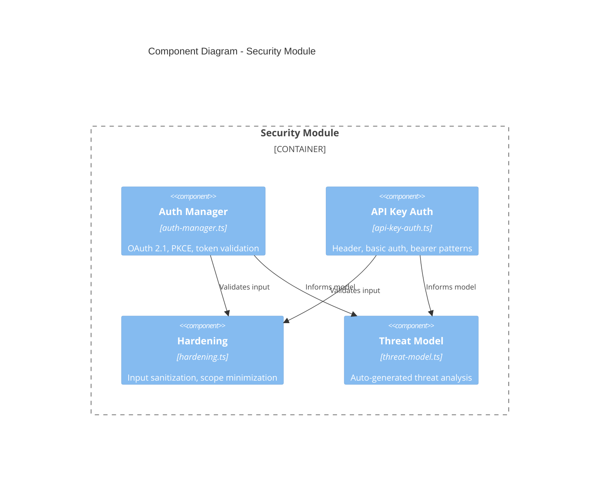
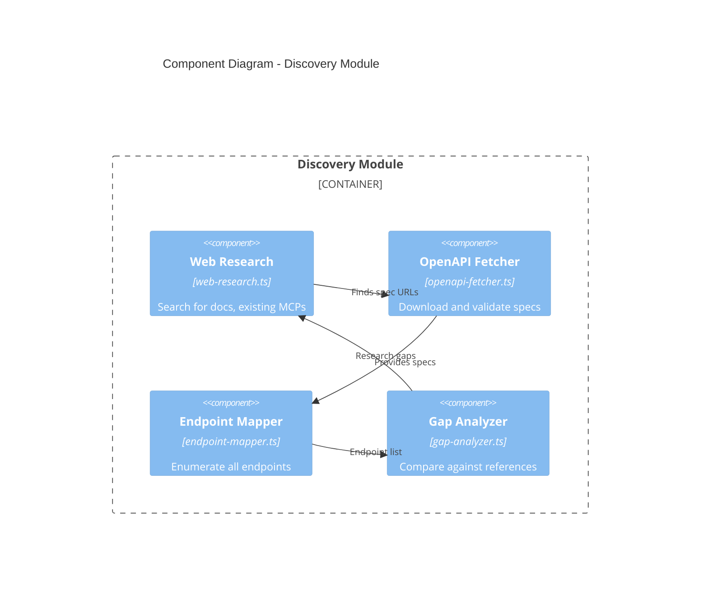
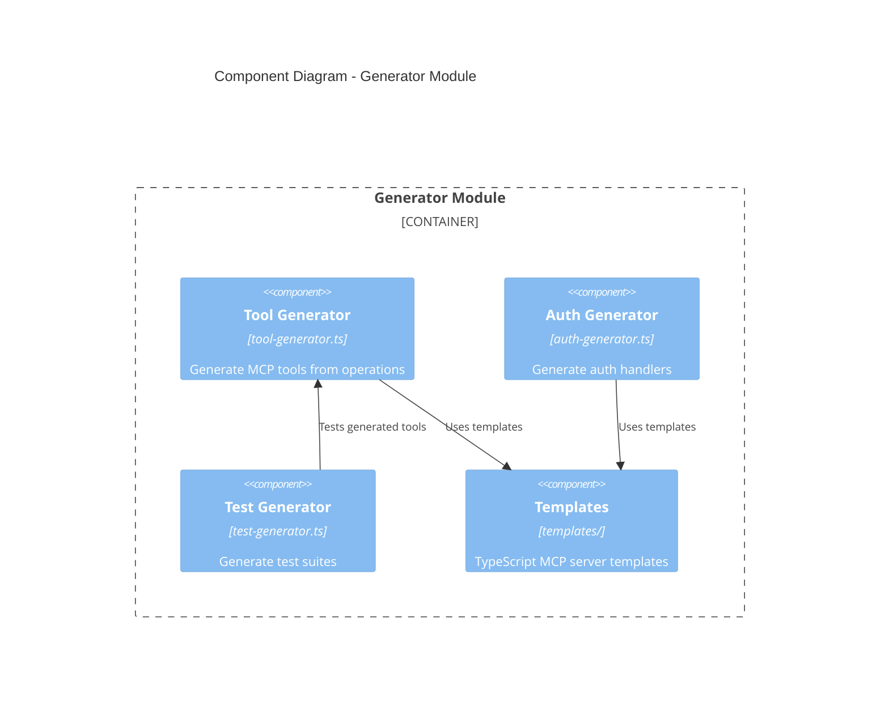
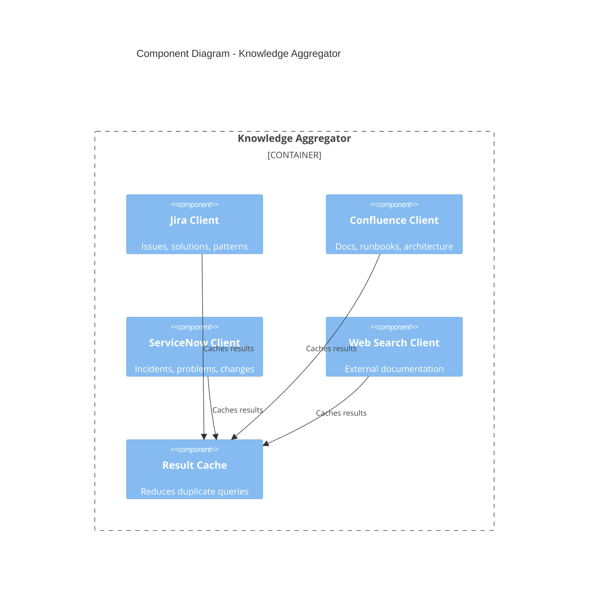
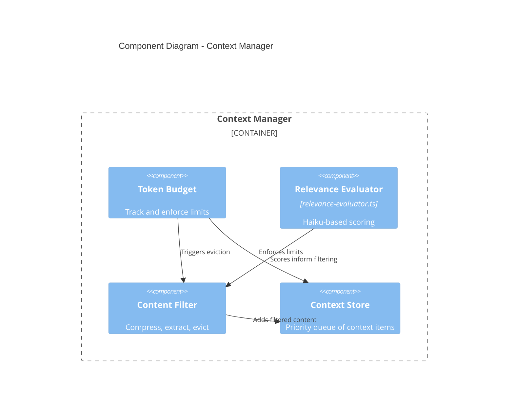

# Component Diagram (C4 Level 3)

> **Scope:** Internal structure of key containers
> **Primary Elements:** Classes, modules, and their relationships

## Orchestrator Components



### State Machine States

```
                    ┌─────────────────┐
                    │     QUEUED      │
                    └────────┬────────┘
                             │ startBuild()
                    ┌────────▼────────┐
                    │   DISCOVERY     │◄────────┐
                    └────────┬────────┘         │
                             │ discoveryComplete │
                    ┌────────▼────────┐         │
                    │   GENERATION    │         │ loopBack
                    └────────┬────────┘         │
                             │ generationComplete│
                    ┌────────▼────────┐         │
                    │    TESTING      │─────────┘
                    └────────┬────────┘
                             │ testsPass
                    ┌────────▼────────┐
                    │   OPTIMIZATION  │
                    └────────┬────────┘
                             │ optimized
                    ┌────────▼────────┐
                    │    COMPLETE     │
                    └─────────────────┘
```

## Bob Instance Manager Components



### Instance Lifecycle

| State | Description | Transitions |
|-------|-------------|-------------|
| **CREATED** | Instance initialized, workspace allocated | → RUNNING |
| **RUNNING** | Claude Code session active | → PAUSED, COMPLETED, FAILED |
| **PAUSED** | Suspended for human review | → RUNNING, TERMINATED |
| **COMPLETED** | Build finished successfully | → DESTROYED |
| **FAILED** | Build failed after retries | → DESTROYED |
| **DESTROYED** | Resources cleaned up | Terminal |

## Governance Components



### Watcher Responsibilities

| Responsibility | Implementation | Threshold |
|----------------|----------------|-----------|
| **Progress Tracking** | Checkpoint system | Every phase completion |
| **Time Limits** | Phase timeout timers | 10 min per phase |
| **Cost Control** | API call cost aggregation | $50 per job |
| **Loop Detection** | Iteration counter | 5 max retries |
| **Context Monitoring** | Token usage tracking | 80% budget warning |

## Security Module Components



### Auth Manager Flow

```
┌───────────────────────────────────────────────────────────────────┐
│                        OAuth 2.1 Flow                              │
├───────────────────────────────────────────────────────────────────┤
│  1. Client requests authorization                                  │
│  2. Auth Manager generates PKCE challenge (S256)                  │
│  3. Redirect to IdP (Entra ID, Okta, Auth0, Keycloak)            │
│  4. User authenticates at IdP                                     │
│  5. IdP returns auth code                                         │
│  6. Auth Manager exchanges code + verifier for tokens             │
│  7. Validate token audience (RFC 8707)                            │
│  8. Store refresh token securely                                  │
│  9. Return access token (15-30 min lifetime)                      │
└───────────────────────────────────────────────────────────────────┘
```

## Discovery Module Components



### Discovery Process

1. **Web Research** → Search for existing MCPs, vendor documentation
2. **Spec Fetching** → Download OpenAPI/Swagger from official sources
3. **Endpoint Mapping** → Parse specs, enumerate ALL endpoints
4. **Gap Analysis** → Compare against reference implementations
5. **Validation** → Test discovered endpoints with live API

## Generator Module Components



## Knowledge Aggregator Components



## Context Manager Components



### Relevance Scoring

| Score Range | Action | Example |
|-------------|--------|---------|
| **< 0.3** | Discard | Unrelated search results |
| **0.3 - 0.5** | Extract key facts | Tangentially related docs |
| **0.5 - 0.7** | Compress | Relevant but verbose |
| **> 0.7** | Keep full | Directly applicable |

## Component Dependencies

```
┌─────────────────────────────────────────────────────────────────────┐
│                      Dependency Graph                                │
├─────────────────────────────────────────────────────────────────────┤
│                                                                      │
│    Plugin ──────► Orchestrator ──────► Bob Manager                  │
│                        │                    │                        │
│                        ▼                    ▼                        │
│                   Governance ◄──────── Discovery                    │
│                        │                    │                        │
│                        ▼                    ▼                        │
│                   Knowledge ◄──────── Generator                     │
│                        │                    │                        │
│                        ▼                    ▼                        │
│                    Context ◄──────── Security                       │
│                        │                    │                        │
│                        ▼                    ▼                        │
│                   Observability ◄──── Testing                       │
│                                                                      │
└─────────────────────────────────────────────────────────────────────┘
```

## Technology Implementation

| Component | Library | Purpose |
|-----------|---------|---------|
| State Machine | XState | Build lifecycle management |
| Validation | Zod | Runtime type safety |
| Logging | Winston | Structured logging |
| Database | better-sqlite3 | Embedded persistence |
| HTTP | node-fetch | API calls |
| MCP | @modelcontextprotocol/sdk | Protocol implementation |

