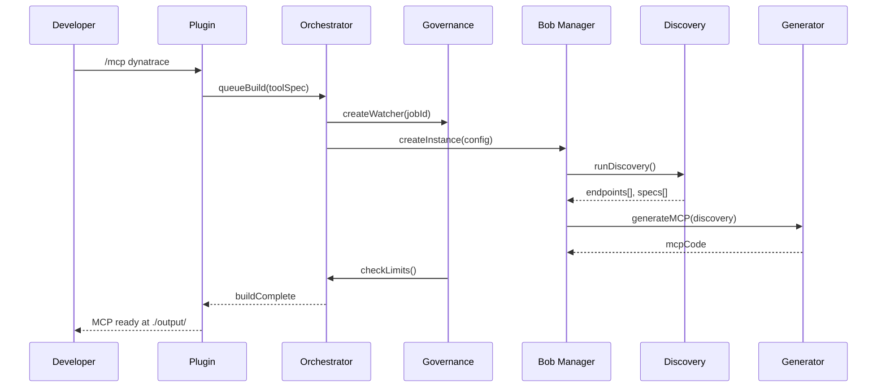
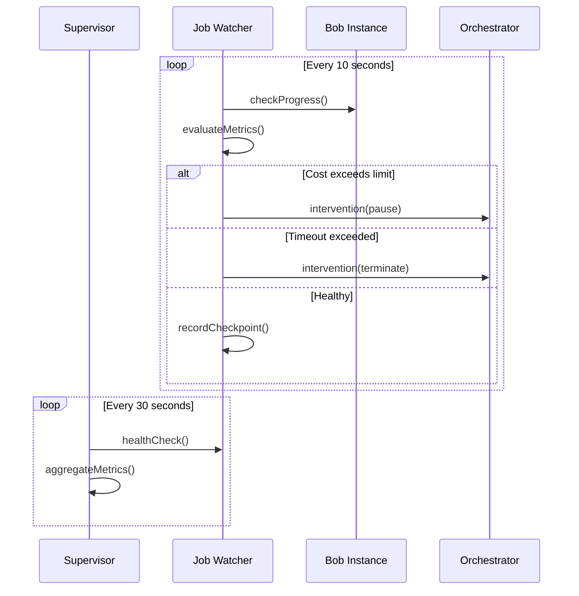

# Container Diagram (C4 Level 2)

> **Scope:** thesun platform internal structure at the deployment unit level
> **Primary Elements:** Containers (not Docker containers, but deployable/runnable units)

## Container Diagram

```mermaid
C4Container
    title Container Diagram - thesun Platform

    Person(dev, "Developer", "Engineers using Claude Code")

    System_Boundary(thesun, "thesun Platform") {
        Container(plugin, "Claude Code Plugin", "TypeScript", "Entry point - handles /mcp, /sun-status commands")
        Container(orchestrator, "Orchestrator", "TypeScript/Node.js", "Central coordinator, state machine, build lifecycle")
        Container(governance, "Governance Layer", "TypeScript/Node.js", "Watchers and supervisor for resource control")
        Container(bob_mgr, "Bob Instance Manager", "TypeScript/Node.js", "Creates/manages isolated Claude sessions")
        Container(discovery, "Discovery Module", "TypeScript/Node.js", "API research, OpenAPI fetching, gap analysis")
        Container(generator, "Generator Module", "TypeScript/Node.js", "Code generation, templates, config abstraction")
        Container(security, "Security Module", "TypeScript/Node.js", "Auth handlers, hardening, threat mitigation")
        Container(knowledge, "Knowledge Aggregator", "TypeScript/Node.js", "Jira, Confluence, ServiceNow, web search")
        Container(context, "Context Manager", "TypeScript/Node.js", "Token budgets, relevance filtering, eviction")
        ContainerDb(state, "State Storage", "SQLite", "Build state, checkpoints, metrics")
        Container(cli, "CLI", "TypeScript/Node.js", "Command-line interface for direct usage")
    }

    System_Ext(claude_api, "Claude API", "AI code generation")
    System_Ext(github, "GitHub", "Source hosting")
    System_Ext(enterprise, "Enterprise Sources", "Jira, Confluence, ServiceNow")
    System_Ext(target_apis, "Target APIs", "APIs to generate MCPs for")

    Rel(dev, plugin, "Commands", "/mcp, /sun-status")
    Rel(plugin, orchestrator, "Triggers builds", "Events")
    Rel(orchestrator, governance, "Monitored by", "Events")
    Rel(orchestrator, bob_mgr, "Creates instances", "API")
    Rel(orchestrator, state, "Persists state", "SQLite")
    Rel(bob_mgr, discovery, "Research phase", "")
    Rel(bob_mgr, generator, "Generate phase", "")
    Rel(discovery, knowledge, "Gets context", "")
    Rel(knowledge, context, "Filtered through", "")
    Rel(generator, security, "Uses auth patterns", "")
    Rel(knowledge, enterprise, "Queries", "REST")
    Rel(discovery, target_apis, "Discovers", "HTTP")
    Rel(bob_mgr, claude_api, "AI calls", "API")
    Rel(orchestrator, github, "Publishes", "gh CLI")
```

## Container Descriptions

### Plugin Layer

| Container | Technology | Purpose | Scaling |
|-----------|------------|---------|---------|
| **Claude Code Plugin** | TypeScript | Entry point for `/mcp` and `/sun-status` commands | Single instance per user |
| **CLI** | TypeScript/Commander | Direct command-line interface for automation | Single instance |

### Core Platform

| Container | Technology | Purpose | Scaling |
|-----------|------------|---------|---------|
| **Orchestrator** | TypeScript/Node.js | Central coordinator, state machine, build lifecycle | Single instance (stateful) |
| **Governance Layer** | TypeScript/Node.js | Per-job watchers + global supervisor | One watcher per job |
| **Bob Instance Manager** | TypeScript/Node.js | Creates isolated Claude Code sessions | Manages N concurrent |
| **State Storage** | SQLite | Persists build state, checkpoints, metrics | Single file database |

### Functional Modules

| Container | Technology | Purpose | Scaling |
|-----------|------------|---------|---------|
| **Discovery Module** | TypeScript | API research, spec fetching, gap analysis | Per-build instance |
| **Generator Module** | TypeScript | Code generation, templates, config abstraction | Per-build instance |
| **Security Module** | TypeScript | OAuth 2.1, API keys, hardening patterns | Shared library |
| **Knowledge Aggregator** | TypeScript | Enterprise context (Jira, Confluence, etc.) | Shared, cached |
| **Context Manager** | TypeScript | Token budget management, relevance filtering | Per-job instance |

## Container Interactions

### Build Flow

### Governance Flow

## Technology Choices

| Decision | Choice | Rationale |
|----------|--------|-----------|
| **Language** | TypeScript | Type safety, ecosystem, Claude Code native |
| **Runtime** | Node.js 18+ | ESM modules, modern APIs, cross-platform |
| **State Storage** | SQLite | Embedded, zero-config, portable |
| **Validation** | Zod | Runtime type safety, great DX |
| **Logging** | Winston | Structured logging, transports |
| **Testing** | Vitest | Fast, ESM native, Jest compatible |

## Resource Requirements

| Container | CPU | Memory | Disk |
|-----------|-----|--------|------|
| Orchestrator | Low | 128MB | Minimal |
| Per Bob Instance | Medium | 512MB | 100MB workspace |
| SQLite State | Low | 64MB | 10MB per 1000 builds |
| Knowledge Aggregator | Low | 256MB (cache) | Minimal |

## Open Questions and Gaps

1. **Horizontal scaling** - Current design is single-node; need to address multi-node orchestration
2. **State replication** - SQLite doesn't support multi-node; may need PostgreSQL for HA
3. **Bob instance limits** - Need to tune max concurrent based on available Claude API quota
