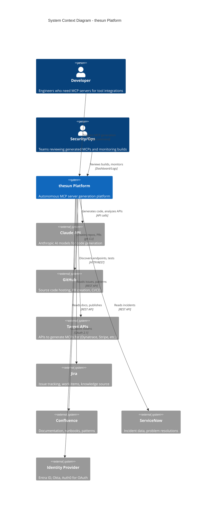

# System Context (C4 Level 1)

> **Scope:** thesun platform and its external dependencies
> **Primary Elements:** External actors, systems, and data flows

## System Context Diagram



## External Systems

### Actors

| Actor | Role | Interaction |
|-------|------|-------------|
| **Developer** | Primary user | Triggers `/mcp <tool>` command to generate MCP servers |
| **Security/Ops** | Reviewer | Monitors builds, reviews generated code, approves deployments |

### External Systems

| System | Purpose | Integration |
|--------|---------|-------------|
| **Claude API** | AI-powered code generation and analysis | Direct API calls via Anthropic SDK |
| **GitHub** | Source hosting, CI/CD, releases | `gh` CLI for repo/PR creation |
| **Target APIs** | Services to create MCPs for | HTTP/REST for discovery and testing |
| **Jira** | Work items and team knowledge | REST API for reading issues, patterns |
| **Confluence** | Documentation and runbooks | REST API for context aggregation |
| **ServiceNow** | Incident history and solutions | REST API for problem patterns |
| **Identity Provider** | User authentication | OAuth 2.1 with PKCE for generated MCPs |

## Data Flows

### Inbound Data

| Source | Data Type | Sensitivity | Purpose |
|--------|-----------|-------------|---------|
| Target APIs | OpenAPI specs, endpoints | Low | API discovery |
| Jira | Issue descriptions, solutions | Medium | Context for generation |
| Confluence | Documentation, patterns | Low-Medium | Best practices |
| ServiceNow | Incident data, workarounds | Medium | Error handling patterns |
| Identity Provider | OAuth tokens | High | Authentication |

### Outbound Data

| Destination | Data Type | Sensitivity | Purpose |
|-------------|-----------|-------------|---------|
| GitHub | Generated MCP code | Low | Publishing |
| Confluence | Architecture docs | Low | Documentation |
| Claude API | Code, prompts | Medium | Generation |

## Trust Boundaries

```
┌─────────────────────────────────────────────────────────────────────┐
│                    INTERNAL TRUST BOUNDARY                          │
│  ┌─────────────────────────────────────────────────────────────┐   │
│  │                     thesun Platform                          │   │
│  │  - Orchestrator (trusted)                                    │   │
│  │  - Bob instances (isolated, semi-trusted)                    │   │
│  │  - Generated code (untrusted until validated)                │   │
│  └─────────────────────────────────────────────────────────────┘   │
└─────────────────────────────────────────────────────────────────────┘
                              │
         NETWORK BOUNDARY (TLS Required)
                              │
┌─────────────────────────────┼─────────────────────────────────────┐
│                    EXTERNAL TRUST BOUNDARY                        │
│                                                                    │
│  ┌──────────┐  ┌──────────┐  ┌──────────┐  ┌──────────┐         │
│  │ Claude   │  │  GitHub  │  │ Target   │  │Enterprise│         │
│  │   API    │  │          │  │  APIs    │  │ Sources  │         │
│  │(Trusted) │  │(Trusted) │  │(Variable)│  │(Trusted) │         │
│  └──────────┘  └──────────┘  └──────────┘  └──────────┘         │
└───────────────────────────────────────────────────────────────────┘
```

## Key Assumptions

1. **Claude API is trusted** - Anthropic's API is assumed to be secure and reliable
2. **Enterprise sources are authenticated** - Jira, Confluence, ServiceNow access uses valid API tokens
3. **Target APIs vary in trust** - Each target API has different security postures; generated MCPs must handle this
4. **Network is untrusted** - All external communications require TLS 1.3

## Open Questions and Gaps

1. **Multi-tenant isolation** - Current design assumes single-tenant; enterprise multi-tenancy not yet addressed
2. **Air-gapped environments** - No support for environments without internet access
3. **API credential rotation** - No automated rotation for long-lived API keys
