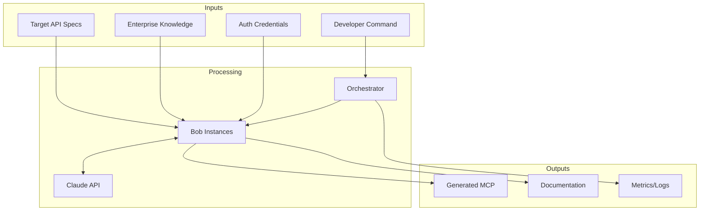
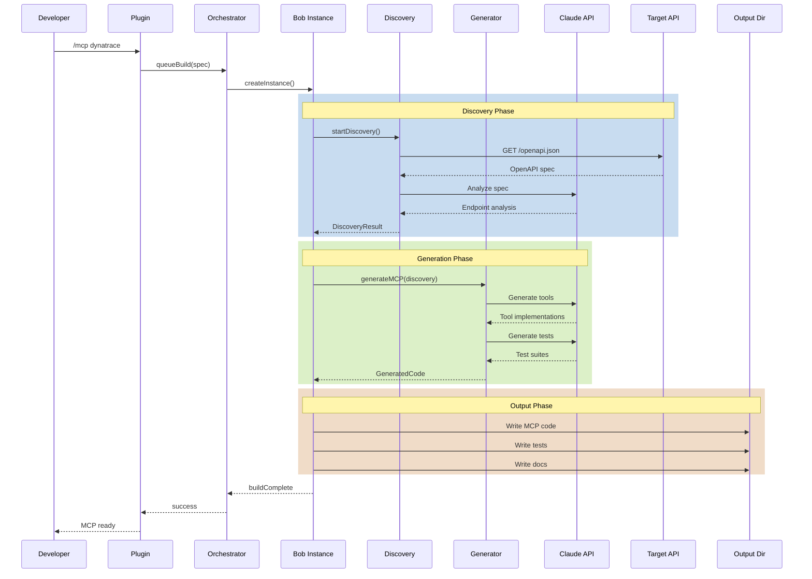
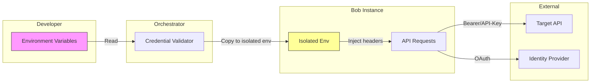
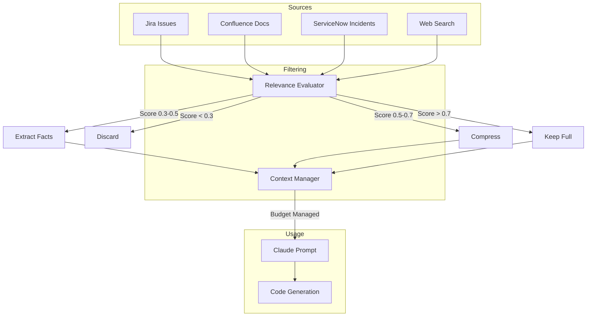
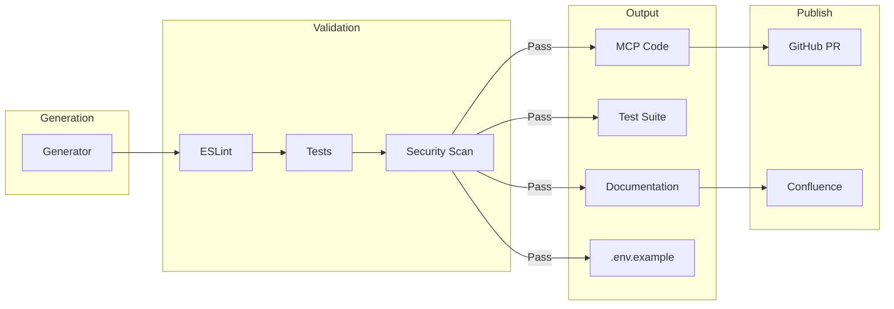
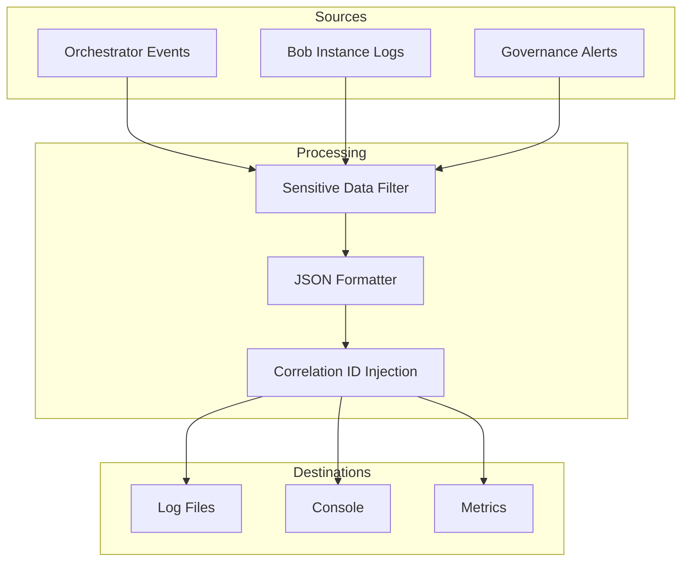
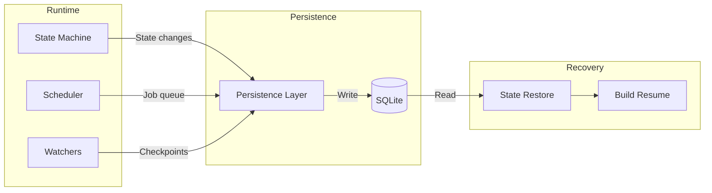

# Data Flow Diagrams

> **Scope:** Data paths, transformations, and trust boundaries
> **Sensitivity:** Classification of data elements

## High-Level Data Flow



## Build Data Flow



## Data Classification

### Sensitivity Levels

| Level | Description | Examples | Handling |
|-------|-------------|----------|----------|
| **PUBLIC** | No restrictions | Generated code, docs | Can be published |
| **INTERNAL** | Company internal | Jira issues, patterns | Not published externally |
| **CONFIDENTIAL** | Restricted access | API keys, tokens | Encrypted, never logged |
| **SECRET** | Highest protection | OAuth secrets | Vault only, never in memory |

### Data Elements by Sensitivity

| Data Element | Classification | Storage | Transmission |
|--------------|----------------|---------|--------------|
| Generated MCP code | PUBLIC | Workspace | Git push |
| OpenAPI specs | PUBLIC | Cache | HTTPS |
| Build logs | INTERNAL | File | Local only |
| Jira content | INTERNAL | Memory/Cache | HTTPS (authenticated) |
| API keys | CONFIDENTIAL | Env vars | HTTPS |
| OAuth tokens | SECRET | Memory only | HTTPS |
| Refresh tokens | SECRET | Secure store | Never |

## Trust Boundaries

```
┌─────────────────────────────────────────────────────────────────────┐
│                    DEVELOPER TRUST BOUNDARY                          │
│  ┌─────────────────────────────────────────────────────────────┐    │
│  │                   Plugin (User Interface)                    │    │
│  │  - Receives commands                                         │    │
│  │  - Displays status                                           │    │
│  │  - No sensitive data storage                                 │    │
│  └─────────────────────────────────────────────────────────────┘    │
└─────────────────────────────────────────────────────────────────────┘
                                │
                    COMMAND VALIDATION
                                │
┌───────────────────────────────▼─────────────────────────────────────┐
│                    ORCHESTRATOR TRUST BOUNDARY                       │
│  ┌─────────────────────────────────────────────────────────────┐    │
│  │                   Orchestrator (Coordinator)                 │    │
│  │  - Validates all inputs                                      │    │
│  │  - Enforces quotas                                           │    │
│  │  - No direct API access                                      │    │
│  └─────────────────────────────────────────────────────────────┘    │
└─────────────────────────────────────────────────────────────────────┘
                                │
                    ISOLATION BOUNDARY
                                │
┌───────────────────────────────▼─────────────────────────────────────┐
│                    BOB INSTANCE TRUST BOUNDARY                       │
│  ┌─────────────────────────────────────────────────────────────┐    │
│  │                   Bob Instance (Isolated)                    │    │
│  │  - Has target API credentials                                │    │
│  │  - Isolated filesystem                                       │    │
│  │  - Isolated environment                                      │    │
│  │  - Generated code is UNTRUSTED until validated              │    │
│  └─────────────────────────────────────────────────────────────┘    │
└─────────────────────────────────────────────────────────────────────┘
                                │
                    NETWORK BOUNDARY (TLS)
                                │
┌───────────────────────────────▼─────────────────────────────────────┐
│                    EXTERNAL TRUST BOUNDARY                           │
│  ┌──────────┐  ┌──────────┐  ┌──────────┐  ┌──────────┐           │
│  │  Claude  │  │  GitHub  │  │  Target  │  │Enterprise│           │
│  │   API    │  │          │  │  APIs    │  │ Sources  │           │
│  │ TRUSTED  │  │ TRUSTED  │  │ VARIABLE │  │ TRUSTED  │           │
│  └──────────┘  └──────────┘  └──────────┘  └──────────┘           │
└─────────────────────────────────────────────────────────────────────┘
```

## Credential Flow



### Credential Rules

1. **Never logged**: Credentials filtered from all log output
2. **Never in code**: Generated MCPs use env var references
3. **Never cached**: Tokens held in memory only, cleared on completion
4. **Never shared**: Each bob instance gets isolated credentials
5. **Validated early**: Credentials checked before build starts

## Context Data Flow



### Token Budget Enforcement

| Budget Type | Limit | Purpose |
|-------------|-------|---------|
| Per-search | 10,000 tokens | Limit individual queries |
| Total context | 50,000 tokens | All accumulated context |
| Reserved | 20,000 tokens | Reasoning space |
| Warning | 80% | Trigger pruning |

## Generated Output Data Flow



### Output Sanitization

All generated output is sanitized before writing:

| Check | Action |
|-------|--------|
| Hardcoded secrets | Block build, alert |
| Internal URLs | Replace with env vars |
| API keys | Replace with env vars |
| IP addresses | Replace with env vars |
| Email addresses | Replace with placeholders |

## Logging Data Flow



### Log Filtering Rules

| Pattern | Action |
|---------|--------|
| `*_API_KEY=*` | Redact value |
| `Authorization:*` | Redact value |
| `Bearer *` | Redact token |
| `password*` | Redact value |
| `secret*` | Redact value |
| `token*` | Redact value |

## State Persistence Data Flow



### Persisted Data

| Table | Data | Retention |
|-------|------|-----------|
| `builds` | Build metadata, status | 90 days |
| `checkpoints` | Progress snapshots | Until build complete |
| `metrics` | Cost, duration stats | 1 year |
| `errors` | Failure patterns | 1 year |
