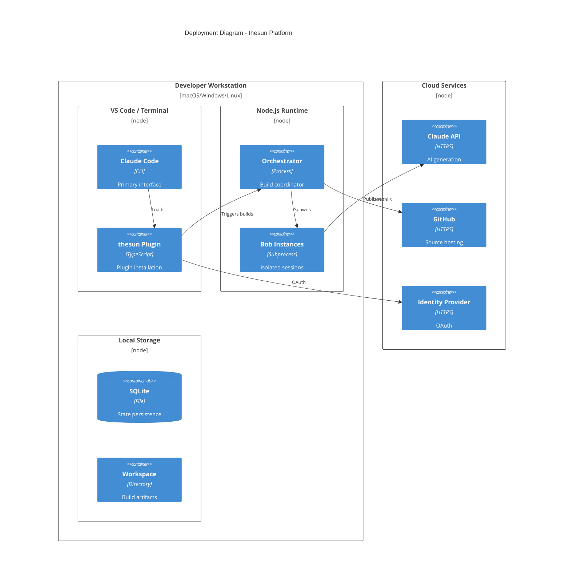

# Deployment Architecture

> **Scope:** Environment configurations and infrastructure requirements
> **Environments:** Development, CI/CD, Production

## Deployment Overview



## Environment Configurations

### Development Environment

```bash
# Required environment variables
export THESUN_DATA_DIR="$HOME/.thesun"
export THESUN_WORKSPACE="$HOME/.thesun/builds"
export LOG_LEVEL="debug"
export MAX_PARALLEL_BUILDS=2
export BOB_ISOLATION_MODE="process"

# Optional for enterprise features
export JIRA_BASE_URL="https://your-company.atlassian.net"
export JIRA_API_TOKEN="your-token"
export CONFLUENCE_BASE_URL="https://your-company.atlassian.net/wiki"
export CONFLUENCE_API_TOKEN="your-token"
```

### Production Environment

```bash
# Production settings
export THESUN_DATA_DIR="/var/lib/thesun"
export THESUN_WORKSPACE="/var/lib/thesun/builds"
export LOG_LEVEL="info"
export MAX_PARALLEL_BUILDS=8
export BOB_ISOLATION_MODE="container"

# Governance limits
export MAX_COST_PER_JOB=50
export MAX_COST_PER_HOUR=200
export MAX_CONCURRENT_JOBS=10
export PHASE_TIMEOUT_MINUTES=10

# Security
export OAUTH_ISSUER="https://login.microsoftonline.com/{tenant}/v2.0"
export OAUTH_CLIENT_ID="your-client-id"
```

## Directory Structure

```
$THESUN_DATA_DIR/
├── thesun.db                    # SQLite state database
├── logs/                        # Application logs
│   ├── orchestrator.log
│   ├── governance.log
│   └── builds/
│       └── {job-id}.log
├── metrics/                     # Prometheus metrics
│   └── metrics.json
└── cache/                       # Knowledge cache
    ├── jira/
    ├── confluence/
    └── web/

$THESUN_WORKSPACE/
├── {job-id}/                    # Per-build workspace
│   ├── discovery/               # API specs, research
│   ├── src/                     # Generated MCP code
│   ├── tests/                   # Generated tests
│   └── output/                  # Final artifacts
└── templates/                   # Shared templates
```

## Resource Requirements

### Minimum Requirements

| Resource | Development | Production |
|----------|-------------|------------|
| **CPU** | 2 cores | 4+ cores |
| **Memory** | 4 GB | 8+ GB |
| **Disk** | 10 GB | 50+ GB |
| **Node.js** | 18+ | 18+ LTS |

### Per-Build Resources

| Component | Memory | Disk | Duration |
|-----------|--------|------|----------|
| Orchestrator | 128 MB | 10 MB | Persistent |
| Bob Instance | 512 MB | 100 MB | Per-build |
| SQLite | 64 MB | 10 MB/1000 builds | Persistent |
| Knowledge Cache | 256 MB | 100 MB | Shared |

## Isolation Modes

### Process Isolation (Development)

```
┌─────────────────────────────────────────────────────────────────┐
│                    Host Operating System                         │
├─────────────────────────────────────────────────────────────────┤
│  ┌─────────────────┐  ┌─────────────────┐  ┌─────────────────┐ │
│  │  Orchestrator   │  │   Bob Instance  │  │   Bob Instance  │ │
│  │    Process      │  │    Process 1    │  │    Process 2    │ │
│  │                 │  │                 │  │                 │ │
│  │  - State        │  │  - Workspace A  │  │  - Workspace B  │ │
│  │  - Scheduler    │  │  - Env vars A   │  │  - Env vars B   │ │
│  └─────────────────┘  └─────────────────┘  └─────────────────┘ │
└─────────────────────────────────────────────────────────────────┘
```

**Characteristics:**
- Lightweight, fast startup
- Shared filesystem namespace (isolated via directories)
- Environment variable isolation via process env
- Suitable for single-user development

### Container Isolation (Production)

```
┌─────────────────────────────────────────────────────────────────┐
│                    Host Operating System                         │
├─────────────────────────────────────────────────────────────────┤
│  ┌─────────────────────────────────────────────────────────────┐│
│  │                   Container Runtime (Docker)                 ││
│  │  ┌─────────────┐  ┌─────────────┐  ┌─────────────┐         ││
│  │  │ Orchestrator│  │   Bob 1     │  │   Bob 2     │         ││
│  │  │  Container  │  │  Container  │  │  Container  │         ││
│  │  │             │  │             │  │             │         ││
│  │  │ - Network   │  │ - Isolated  │  │ - Isolated  │         ││
│  │  │ - Volume    │  │   network   │  │   network   │         ││
│  │  └─────────────┘  └─────────────┘  └─────────────┘         ││
│  └─────────────────────────────────────────────────────────────┘│
└─────────────────────────────────────────────────────────────────┘
```

**Characteristics:**
- Full filesystem isolation
- Network namespace isolation
- Resource limits (cgroups)
- Suitable for multi-tenant production

## Network Architecture

```
┌──────────────────────────────────────────────────────────────────┐
│                     Network Boundaries                            │
├──────────────────────────────────────────────────────────────────┤
│                                                                   │
│  ┌─────────────────────────────────────────────────────────────┐ │
│  │                 INTERNAL NETWORK                             │ │
│  │                                                              │ │
│  │  Orchestrator ◄──► Bob Instances ◄──► State Storage         │ │
│  │       │                                                      │ │
│  └───────┼──────────────────────────────────────────────────────┘ │
│          │                                                        │
│          │ TLS 1.3 Required                                       │
│          │                                                        │
│  ┌───────▼──────────────────────────────────────────────────────┐ │
│  │                 EXTERNAL NETWORK                             │ │
│  │                                                              │ │
│  │  Claude API    GitHub    Target APIs    Enterprise Sources   │ │
│  │  (Trusted)    (Trusted)  (Variable)      (Authenticated)    │ │
│  │                                                              │ │
│  └──────────────────────────────────────────────────────────────┘ │
└──────────────────────────────────────────────────────────────────┘
```

### Egress Requirements

| Destination | Port | Protocol | Purpose |
|-------------|------|----------|---------|
| api.anthropic.com | 443 | HTTPS | Claude API |
| github.com | 443 | HTTPS | Repository operations |
| *.atlassian.net | 443 | HTTPS | Jira, Confluence |
| login.microsoftonline.com | 443 | HTTPS | Entra ID OAuth |
| Target API domains | 443 | HTTPS | API discovery/testing |

## High Availability (Future)

Current architecture is single-node. For HA deployment:

```
                    ┌─────────────────┐
                    │  Load Balancer  │
                    └────────┬────────┘
                             │
         ┌───────────────────┼───────────────────┐
         │                   │                   │
   ┌─────▼─────┐       ┌─────▼─────┐       ┌─────▼─────┐
   │  Node 1   │       │  Node 2   │       │  Node 3   │
   │           │       │           │       │           │
   │ Orch      │       │ Orch      │       │ Orch      │
   │ Bob×N     │       │ Bob×N     │       │ Bob×N     │
   └─────┬─────┘       └─────┬─────┘       └─────┬─────┘
         │                   │                   │
         └───────────────────┼───────────────────┘
                             │
                    ┌────────▼────────┐
                    │   PostgreSQL    │
                    │   (Replicated)  │
                    └─────────────────┘
```

**Requirements for HA:**
- Replace SQLite with PostgreSQL for shared state
- Implement leader election for scheduler
- Distributed job locking
- Shared filesystem or object storage for workspaces

## Monitoring & Observability

### Metrics Endpoints

| Endpoint | Format | Purpose |
|----------|--------|---------|
| `/metrics` | Prometheus | Scrape metrics |
| `/health` | JSON | Liveness check |
| `/ready` | JSON | Readiness check |

### Key Metrics

| Metric | Type | Description |
|--------|------|-------------|
| `thesun_builds_total` | Counter | Total builds by status |
| `thesun_build_duration_seconds` | Histogram | Build duration |
| `thesun_api_calls_total` | Counter | Claude API calls |
| `thesun_cost_dollars` | Gauge | Accumulated cost |
| `thesun_active_bobs` | Gauge | Active bob instances |

### Logging Configuration

```typescript
// Winston logger configuration
{
  level: process.env.LOG_LEVEL || 'info',
  format: combine(
    timestamp(),
    json()
  ),
  transports: [
    new transports.File({ filename: 'orchestrator.log' }),
    new transports.Console()
  ]
}
```

## Backup & Recovery

### State Backup

```bash
# Backup SQLite database
sqlite3 $THESUN_DATA_DIR/thesun.db ".backup 'backup.db'"

# Backup workspaces (optional)
tar -czf workspaces-backup.tar.gz $THESUN_WORKSPACE
```

### Recovery Procedure

1. Stop orchestrator
2. Restore SQLite database from backup
3. Restore workspace directories if needed
4. Restart orchestrator
5. Resume interrupted builds (idempotent)

## Cross-Platform Notes

| Platform | Node.js | Shell | Path Separator |
|----------|---------|-------|----------------|
| macOS | Homebrew/nvm | zsh/bash | `/` |
| Linux | apt/nvm | bash | `/` |
| Windows | winget/nvm | PowerShell/cmd | `\` |

All file paths use `path.join()` for cross-platform compatibility.
