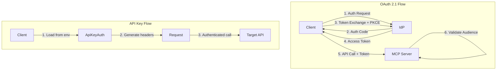
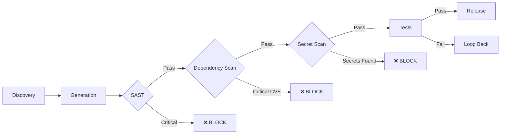

# Security Architecture

> **Scope:** Threat model, security controls, and compliance
> **Framework:** Based on MCP Security Best Practices and OWASP

## Threat Model Overview

```
┌─────────────────────────────────────────────────────────────────────┐
│                        THREAT LANDSCAPE                              │
├─────────────────────────────────────────────────────────────────────┤
│                                                                      │
│  ┌───────────────┐  ┌───────────────┐  ┌───────────────┐           │
│  │   External    │  │   Internal    │  │   Supply      │           │
│  │   Attackers   │  │   Threats     │  │   Chain       │           │
│  │               │  │               │  │               │           │
│  │ - API abuse   │  │ - Credential  │  │ - Malicious   │           │
│  │ - Injection   │  │   leakage     │  │   deps        │           │
│  │ - Token theft │  │ - Over-       │  │ - Compromised │           │
│  │               │  │   privilege   │  │   specs       │           │
│  └───────────────┘  └───────────────┘  └───────────────┘           │
│                                                                      │
└─────────────────────────────────────────────────────────────────────┘
```

## STRIDE Threat Analysis

### Spoofing Identity

| Threat | Attack Vector | Mitigation | Control |
|--------|---------------|------------|---------|
| T1.1 | Impersonate user to Claude API | OAuth 2.1 with PKCE | AuthManager |
| T1.2 | Forge API credentials | Credential validation on startup | ApiKeyAuth |
| T1.3 | Token replay attack | Short-lived tokens (15-30 min) | AuthManager |

### Tampering

| Threat | Attack Vector | Mitigation | Control |
|--------|---------------|------------|---------|
| T2.1 | Modify generated code | Code signing (future) | SecurityHardening |
| T2.2 | Alter API specs | Spec validation against schema | Discovery |
| T2.3 | Tamper with state DB | SQLite integrity checks | Persistence |

### Repudiation

| Threat | Attack Vector | Mitigation | Control |
|--------|---------------|------------|---------|
| T3.1 | Deny build execution | Structured logging with correlation IDs | Logger |
| T3.2 | Dispute API calls | Request/response logging | Observability |
| T3.3 | Modify audit trail | Append-only log files | Logger |

### Information Disclosure

| Threat | Attack Vector | Mitigation | Control |
|--------|---------------|------------|---------|
| T4.1 | Credential leakage in logs | Sensitive data filtering | Logger |
| T4.2 | Secrets in generated code | Output sanitization | Generator |
| T4.3 | Token exposure in errors | Error message sanitization | SecurityHardening |
| T4.4 | Context leakage between builds | Bob instance isolation | BobManager |

### Denial of Service

| Threat | Attack Vector | Mitigation | Control |
|--------|---------------|------------|---------|
| T5.1 | Runaway builds exhausting quota | Per-job cost limits ($50) | JobWatcher |
| T5.2 | Resource exhaustion | Global limits ($200/hr) | Supervisor |
| T5.3 | Infinite retry loops | Max retries (5) | JobWatcher |
| T5.4 | Context window exhaustion | Token budgets | ContextManager |

### Elevation of Privilege

| Threat | Attack Vector | Mitigation | Control |
|--------|---------------|------------|---------|
| T6.1 | Token passthrough to gain access | MUST NOT passthrough tokens | AuthManager |
| T6.2 | Scope escalation | Scope minimization | AuthManager |
| T6.3 | Command injection | Input sanitization | SecurityHardening |
| T6.4 | Path traversal | Path validation | SecurityHardening |

## Security Controls

### Authentication Controls



#### OAuth 2.1 Requirements

| Requirement | Status | Implementation |
|-------------|--------|----------------|
| PKCE (S256) | ✅ MUST | `generateCodeChallenge()` |
| Audience validation | ✅ MUST | `validateToken()` |
| No token passthrough | ✅ MUST NOT | Architectural constraint |
| Short-lived tokens | ✅ SHOULD | 15-30 minute default |
| Refresh token rotation | ✅ SHOULD | `refreshAccessToken()` |

#### Identity Provider Support

| Provider | Discovery | PKCE | Resource Indicators | On-Behalf-Of |
|----------|-----------|------|---------------------|--------------|
| Entra ID | ✅ | ✅ | ✅ | ✅ |
| Okta | ✅ | ✅ | ✅ | ✅ |
| Auth0 | ✅ | ✅ | ⚠️ Limited | ❌ |
| Keycloak | ✅ | ✅ | ✅ | ✅ |

### Input Validation Controls

```typescript
// SQL Injection Prevention
const SQL_INJECTION_PATTERNS = [
  /(\b(SELECT|INSERT|UPDATE|DELETE|DROP|UNION|ALTER)\b)/i,
  /(-{2}|\/\*|\*\/|;)/,
  /(\bOR\b|\bAND\b)\s+\d+\s*=\s*\d+/i,
];

// Command Injection Prevention
const COMMAND_INJECTION_PATTERNS = [
  /[;&|`$(){}[\]<>]/,
  /\b(exec|system|spawn|fork)\b/i,
];

// Path Traversal Prevention
const PATH_TRAVERSAL_PATTERNS = [
  /\.\.[\/\\]/,
  /^[\/\\]/,
  /%2e%2e/i,
];
```

### Scope Minimization

| Permission Level | Scopes | Use Case |
|-----------------|--------|----------|
| Basic | `mcp:tools-basic` | Read-only operations |
| Standard | `mcp:tools-basic,mcp:tools-write` | Standard operations |
| Admin | `mcp:tools-basic,mcp:tools-write,mcp:admin` | Administrative tasks |

Wildcard scopes (`*`, `all`, `full-access`) are **always rejected**.

### Isolation Controls

```
┌─────────────────────────────────────────────────────────────────────┐
│                    Bob Instance Isolation                            │
├─────────────────────────────────────────────────────────────────────┤
│                                                                      │
│  ┌─────────────────┐    ┌─────────────────┐    ┌─────────────────┐ │
│  │  Bob Instance A │    │  Bob Instance B │    │  Bob Instance C │ │
│  │                 │    │                 │    │                 │ │
│  │ ┌─────────────┐ │    │ ┌─────────────┐ │    │ ┌─────────────┐ │ │
│  │ │  Workspace  │ │    │ │  Workspace  │ │    │ │  Workspace  │ │ │
│  │ │  /tmp/a/    │ │    │ │  /tmp/b/    │ │    │ │  /tmp/c/    │ │ │
│  │ └─────────────┘ │    │ └─────────────┘ │    │ └─────────────┘ │ │
│  │                 │    │                 │    │                 │ │
│  │ ┌─────────────┐ │    │ ┌─────────────┐ │    │ ┌─────────────┐ │ │
│  │ │  Env Vars   │ │    │ │  Env Vars   │ │    │ │  Env Vars   │ │ │
│  │ │  (isolated) │ │    │ │  (isolated) │ │    │ │  (isolated) │ │ │
│  │ └─────────────┘ │    │ └─────────────┘ │    │ └─────────────┘ │ │
│  │                 │    │                 │    │                 │ │
│  │ ❌ No shared   │    │ ❌ No shared   │    │ ❌ No shared   │ │
│  │    memory      │    │    memory      │    │    memory      │ │
│  └─────────────────┘    └─────────────────┘    └─────────────────┘ │
│                                                                      │
└─────────────────────────────────────────────────────────────────────┘
```

## Security Gates



### Gate Criteria

| Gate | Tool | Block Criteria |
|------|------|----------------|
| SAST | ESLint-security | Any critical finding |
| Dependency | npm audit / Snyk | Critical CVE |
| Secrets | Custom scanner | Any detected secret |
| Tests | Vitest | Coverage < 80% or failures |

## Known Vulnerabilities Addressed

### CVE-2025-49596 (MCP Inspector RCE)

**Description:** Remote code execution via malicious server in MCP Inspector

**Mitigation:**
- Generated MCPs never execute arbitrary code strings
- All dynamic code execution is blocked by SAST
- Input parameters are validated before use

### SQLite Injection (MCP Reference)

**Description:** SQL injection in official SQLite MCP reference server

**Mitigation:**
- All database queries use parameterized statements
- Input validation blocks SQL injection patterns
- Generated code uses ORM patterns

### Token Passthrough Attack

**Description:** MCP servers passing client tokens to downstream APIs

**Mitigation:**
- Architectural constraint: tokens MUST NOT be passed through
- On-Behalf-Of flow for downstream access
- Audience validation ensures tokens are for THIS server

## Compliance Mapping

### SOC 2 Type II

| Control | thesun Implementation |
|---------|----------------------|
| CC6.1 Logical Access | OAuth 2.1, RBAC |
| CC6.2 Authentication | PKCE, MFA support |
| CC6.3 Authorization | Scope minimization |
| CC6.6 Boundary Protection | TLS 1.3, network isolation |
| CC6.7 Information Transmission | Encrypted channels |
| CC7.2 Monitoring | Structured logging |

### OWASP Top 10

| Risk | Mitigation |
|------|------------|
| A01 Broken Access Control | Scope validation, audience checking |
| A02 Cryptographic Failures | TLS 1.3, no credential storage |
| A03 Injection | Input sanitization, parameterized queries |
| A04 Insecure Design | Threat modeling, security gates |
| A05 Security Misconfiguration | Secure defaults, validation |
| A06 Vulnerable Components | Dependency scanning |
| A07 Auth Failures | OAuth 2.1, PKCE |
| A08 Data Integrity Failures | Code validation, signing (future) |
| A09 Logging Failures | Structured logging, audit trail |
| A10 SSRF | URL validation, allowlists |

## Security Checklist

For each generated MCP:

### Authentication
- [ ] OAuth 2.1 or API key auth implemented
- [ ] PKCE enabled for all OAuth flows
- [ ] Token audience validation configured
- [ ] No token passthrough
- [ ] Short-lived access tokens (15-30 min)

### Input Validation
- [ ] All parameters validated with Zod schemas
- [ ] SQL injection patterns blocked
- [ ] Command injection patterns blocked
- [ ] Path traversal patterns blocked
- [ ] Wildcard scopes rejected

### Output Security
- [ ] No hardcoded credentials in code
- [ ] No internal URLs in code
- [ ] Sensitive data filtered from logs
- [ ] Error messages sanitized

### Infrastructure
- [ ] TLS 1.3 for all external connections
- [ ] Environment variables for all secrets
- [ ] Isolated execution environment
- [ ] Resource limits configured

## Incident Response

### Detection

| Signal | Source | Action |
|--------|--------|--------|
| Repeated auth failures | Logs | Alert + rate limit |
| Cost spike | Metrics | Pause builds |
| Secret in code | Scanner | Block release |
| Injection attempt | Input validation | Log + block |

### Response Procedures

1. **Credential Leak**
   - Immediate: Revoke affected credentials
   - Short-term: Rotate all related tokens
   - Long-term: Review access patterns

2. **Compromised Build**
   - Immediate: Quarantine output
   - Short-term: Review generated code
   - Long-term: Add detection patterns

3. **API Abuse**
   - Immediate: Rate limit client
   - Short-term: Review access logs
   - Long-term: Adjust quotas
