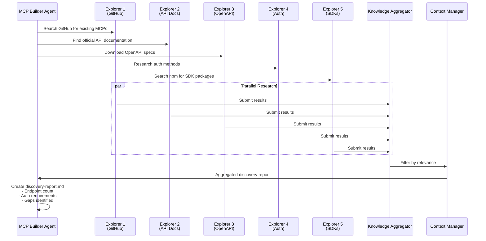
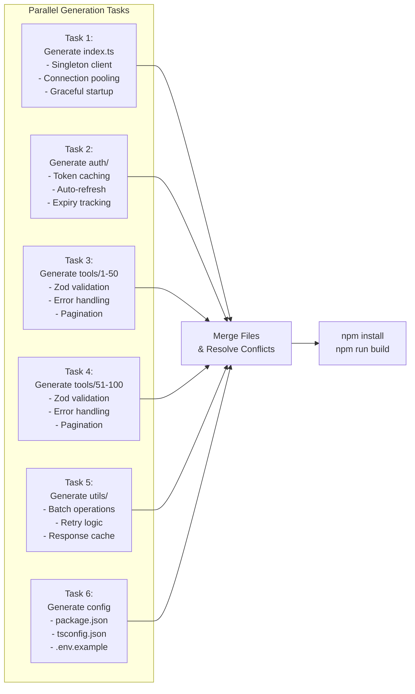
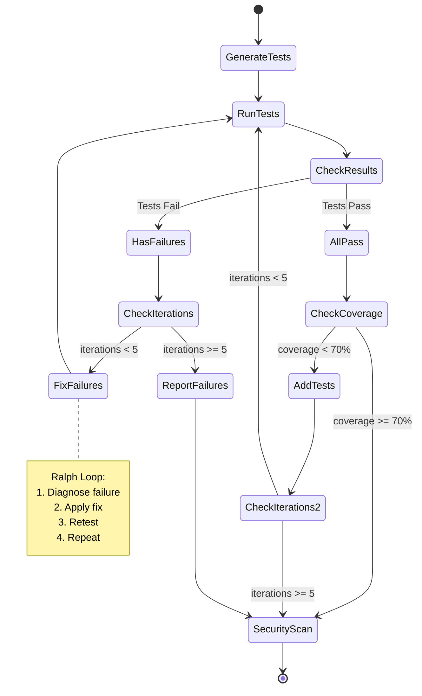
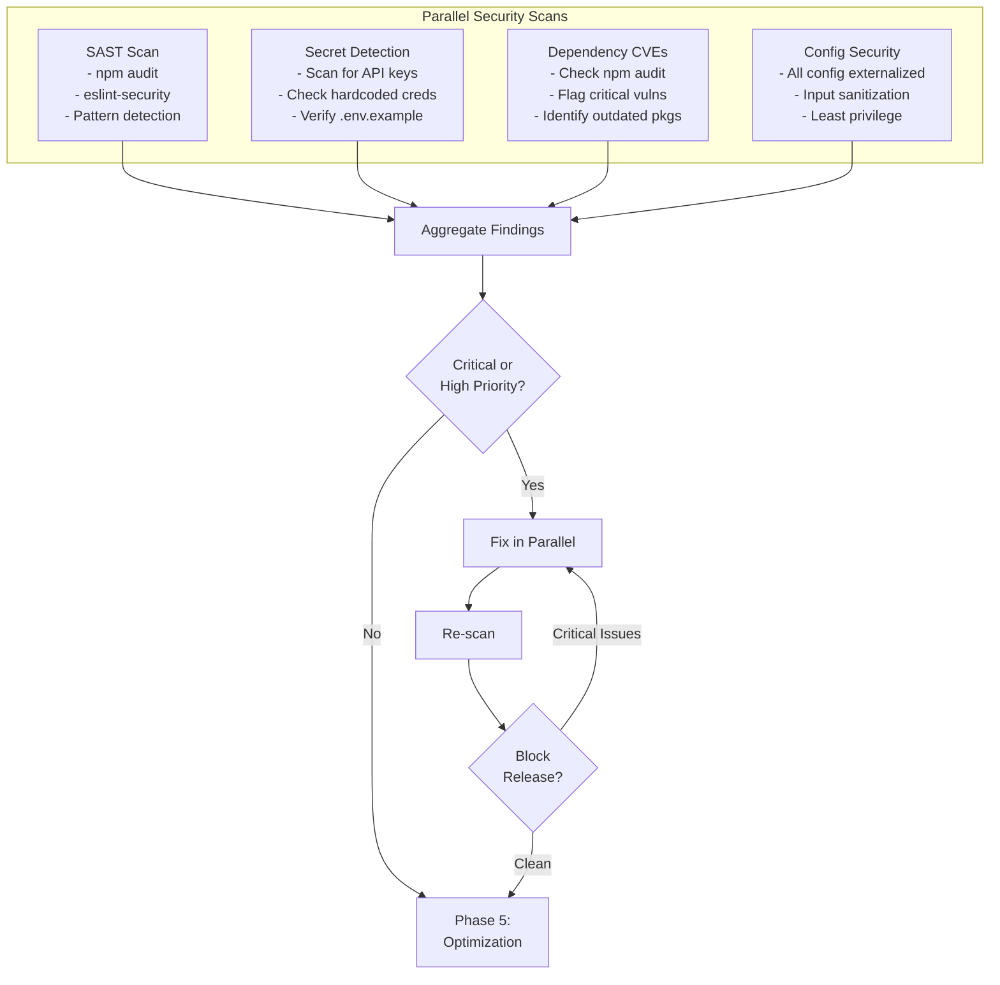
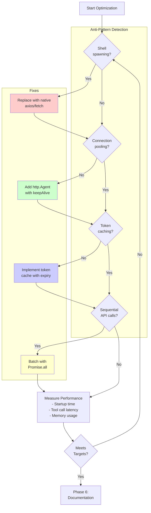
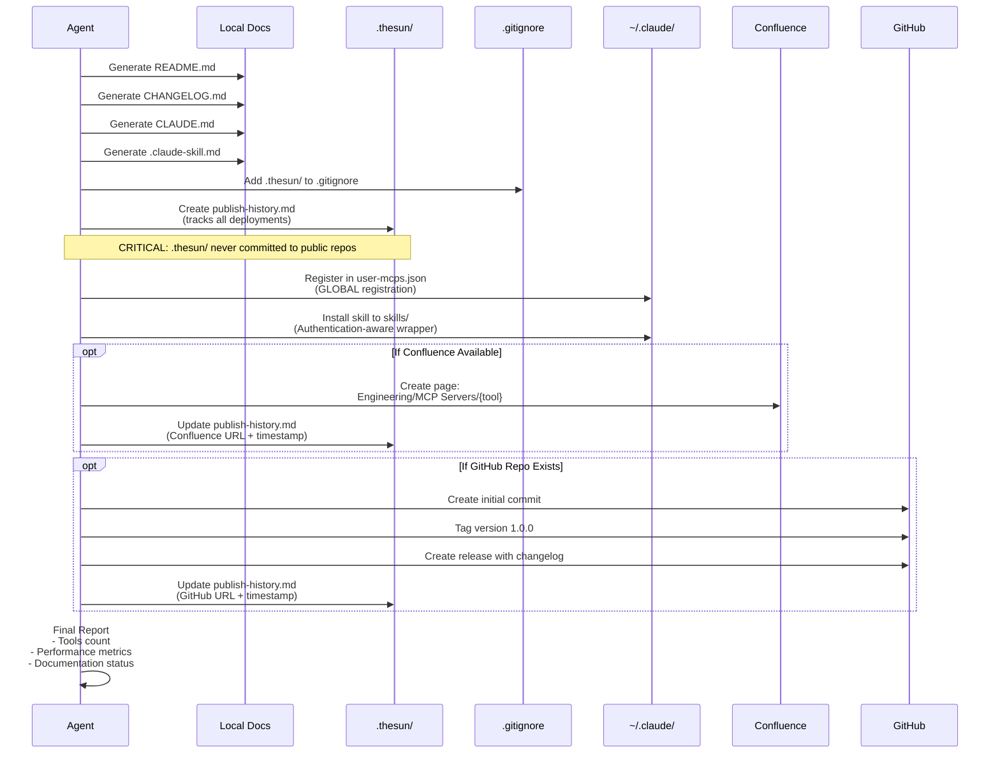
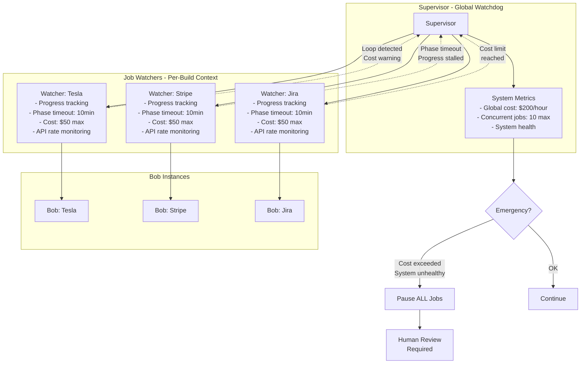
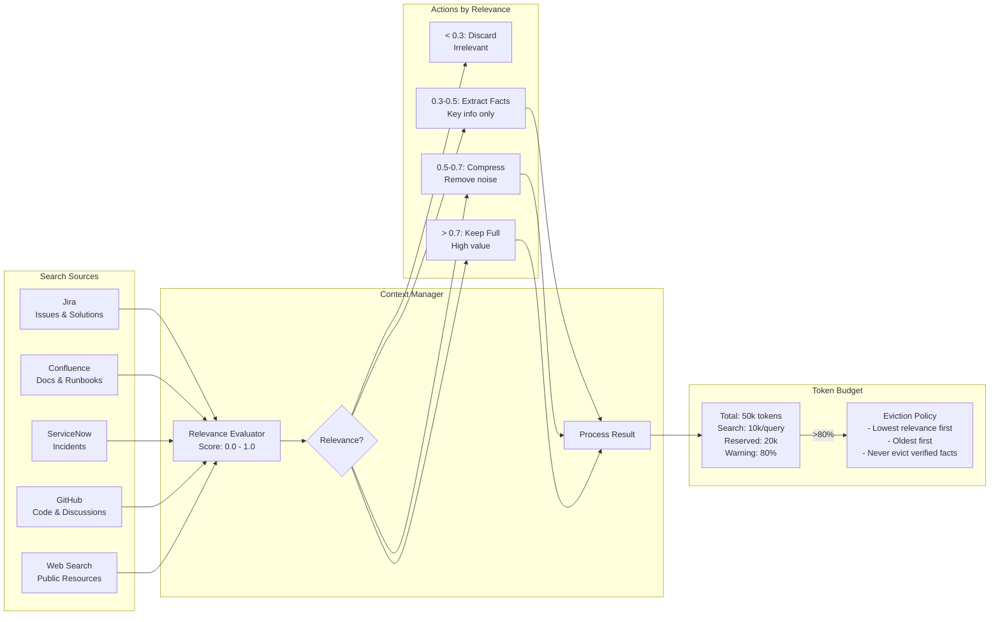
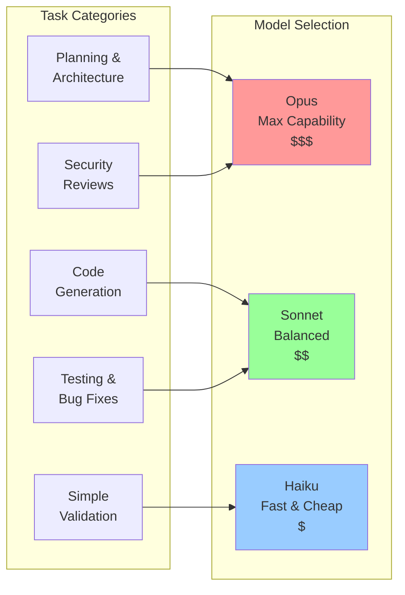

# thesun - Complete Architecture Flow

## System Overview

```mermaid
graph TB
    User[User: 'use thesun for Tesla']

    subgraph "Entry Point"
        MCP[thesun MCP Server<br/>~/Scripts/thesun/src/mcp-server/index.ts]
        Tool[thesun Tool]
    end

    subgraph "Mode Selection"
        CreateMode{CREATE or FIX?}
        BatchMode{Single or Batch?}
    end

    subgraph "Orchestrator Layer"
        Orchestrator[Central Orchestrator<br/>orchestrator/index.ts]
        StateMachine[State Machine<br/>Build Lifecycle]
        Scheduler[Parallel Scheduler<br/>Resource Limits]
        Persistence[SQLite Persistence<br/>Idempotent State]
    end

    subgraph "Governance Layer"
        Supervisor[Supervisor<br/>Global Watchdog]
        Watcher1[Job Watcher 1<br/>Tesla MCP]
        Watcher2[Job Watcher 2<br/>Stripe MCP]
        Watcher3[Job Watcher 3<br/>Jira MCP]
    end

    subgraph "Bob Isolation - Parallel Builds"
        Bob1[Bob Instance 1<br/>Git Worktree: build/tesla<br/>Inherits: User MCPs + Plugins]
        Bob2[Bob Instance 2<br/>Git Worktree: build/stripe<br/>Inherits: User MCPs + Plugins]
        Bob3[Bob Instance 3<br/>Git Worktree: build/jira<br/>Inherits: User MCPs + Plugins]
    end

    subgraph "Build Pipeline - 6 Phases"
        P1[PHASE 1: Discovery<br/>Parallel Research]
        P2[PHASE 2: Generation<br/>Parallel Code Gen]
        P3[PHASE 3: Testing<br/>Ralph Loops]
        P4[PHASE 4: Security<br/>Parallel Scans]
        P5[PHASE 5: Optimization<br/>Performance]
        P6[PHASE 6: Documentation<br/>+ Registration]
    end

    subgraph "Phase 1: Discovery Tasks (Parallel)"
        D1[Explore: GitHub MCPs]
        D2[Explore: API Docs]
        D3[Explore: OpenAPI Specs]
        D4[Explore: Auth Methods]
        D5[Explore: SDK Packages]
    end

    subgraph "Phase 2: Generation Tasks (Parallel)"
        G1[Generate: index.ts<br/>Graceful Startup]
        G2[Generate: auth/<br/>Token Caching]
        G3[Generate: tools/<br/>Endpoint 1-N]
        G4[Generate: tools/<br/>Endpoint N+1-2N]
        G5[Generate: utils/<br/>Batch Ops]
        G6[Generate: Config Files]
    end

    subgraph "Phase 3: Testing (Ralph Loop)"
        T1[Generate Tests<br/>Parallel by Module]
        T2[Run Tests]
        T3{Tests Pass?}
        T4[Fix Failures]
        T5{Iterations < 5?}
    end

    subgraph "Phase 4: Security Scans (Parallel)"
        S1[SAST Scan<br/>eslint-security]
        S2[Secret Detection<br/>No Hardcoded Keys]
        S3[Dependency CVE<br/>npm audit]
        S4[Config Security<br/>Externalized Config]
    end

    subgraph "Phase 5: Optimization"
        O1[Detect Anti-Patterns<br/>Shell Spawning?]
        O2[Check Connection Pooling]
        O3[Check Token Caching]
        O4[Apply Optimizations]
        O5[Measure Performance<br/>< 500ms target]
    end

    subgraph "Phase 6: Documentation & Registration"
        Doc1[Generate README.md]
        Doc2[Generate CHANGELOG.md]
        Doc3[Generate .claude-skill.md]
        Doc4[Create .thesun/publish-history.md]
        Reg1[Register in ~/.claude/user-mcps.json]
        Reg2[Install Skill to ~/.claude/skills/]
        Doc5[Publish to Confluence]
        Doc6[Create GitHub Release]
    end

    subgraph "Context Management"
        CM[Context Manager<br/>Token Budget Tracking]
        RE[Relevance Evaluator<br/>Filter Search Results]
        KA[Knowledge Aggregator<br/>Jira, Confluence, ServiceNow]
    end

    subgraph "External Systems"
        Jira[Jira<br/>Issues & Patterns]
        Conf[Confluence<br/>Docs & Runbooks]
        GH[GitHub<br/>Existing MCPs]
        SN[ServiceNow<br/>Incident Patterns]
    end

    subgraph "Output"
        Output[~/Scripts/mcp-servers/<br/>tesla-mcp/<br/>stripe-mcp/<br/>jira-mcp/]
        Config[~/.claude/user-mcps.json<br/>Global Registration]
        Skills[~/.claude/skills/<br/>tesla.md<br/>stripe.md]
    end

    User -->|thesun({target})| MCP
    MCP -->|Parse Args| Tool
    Tool --> CreateMode
    CreateMode -->|fix: path| FIX[FIX MODE<br/>Analyze & Repair]
    CreateMode -->|No fix| BatchMode
    BatchMode -->|targets: []| Orchestrator
    BatchMode -->|Single| Orchestrator

    Orchestrator --> Scheduler
    Orchestrator --> StateMachine
    Orchestrator --> Persistence

    Scheduler -->|Spawn Parallel| Bob1
    Scheduler -->|Spawn Parallel| Bob2
    Scheduler -->|Spawn Parallel| Bob3

    Supervisor -->|Watches| Watcher1
    Supervisor -->|Watches| Watcher2
    Supervisor -->|Watches| Watcher3

    Watcher1 -->|Monitors| Bob1
    Watcher2 -->|Monitors| Bob2
    Watcher3 -->|Monitors| Bob3

    Bob1 --> P1
    P1 --> D1 & D2 & D3 & D4 & D5
    D1 & D2 & D3 & D4 & D5 -->|Aggregate| P2

    P2 --> G1 & G2 & G3 & G4 & G5 & G6
    G1 & G2 & G3 & G4 & G5 & G6 -->|Merge & Resolve| P3

    P3 --> T1
    T1 --> T2
    T2 --> T3
    T3 -->|Fail| T4
    T4 --> T5
    T5 -->|Yes| T2
    T5 -->|No| P4
    T3 -->|Pass| P4

    P4 --> S1 & S2 & S3 & S4
    S1 & S2 & S3 & S4 -->|Aggregate| P5

    P5 --> O1
    O1 --> O2
    O2 --> O3
    O3 --> O4
    O4 --> O5
    O5 --> P6

    P6 --> Doc1 & Doc2 & Doc3 & Doc4
    Doc1 & Doc2 & Doc3 & Doc4 --> Reg1
    Reg1 --> Reg2
    Reg2 --> Doc5
    Doc5 --> Doc6
    Doc6 --> Output

    P1 -.->|Search| KA
    KA -.->|Query| Jira
    KA -.->|Query| Conf
    KA -.->|Query| GH
    KA -.->|Query| SN

    KA --> CM
    CM --> RE
    RE -->|Filtered Results| P1

    Output --> Config
    Output --> Skills

    style User fill:#e1f5ff
    style MCP fill:#fff4e1
    style Orchestrator fill:#ffe1f5
    style Supervisor fill:#ff9999
    style Bob1 fill:#99ff99
    style Bob2 fill:#99ff99
    style Bob3 fill:#99ff99
    style Output fill:#99ccff
```

## Detailed Phase Breakdown

### Phase 1: Discovery (Parallel Research)



### Phase 2: Generation (Parallel Code Gen)



### Phase 3: Testing with Ralph Loops



### Phase 4: Security Scans (Parallel)



### Phase 5: Optimization & Performance



### Phase 6: Documentation, Registration & Deployment



## MCP Update/Improve Workflow (Phase 5 of Pipeline)

```mermaid
flowchart TB
    Start[Update MCPs Trigger]

    subgraph "Phase 0: Fork Sync"
        CheckFork{Has<br/>Upstream?}
        FetchUpstream[git fetch upstream]
        CheckBehind{Behind<br/>upstream?}
        SyncUpstream[git merge upstream/main]
        Rebuild[npm install<br/>npm run build]
    end

    subgraph "Phase 1: Performance Analysis (CRITICAL)"
        DetectAnti[Detect Anti-Patterns<br/>- grep for child_process<br/>- Check connection pooling<br/>- Check token caching]
        MeasureBaseline[Measure Baseline<br/>- Time tool calls<br/>- Profile startup]
        ApplyOpt[Apply Optimizations<br/>- Connection pooling<br/>- Token caching<br/>- Batch operations]
        MeasureAfter[Measure After<br/>- Verify improvement<br/>- 5-10x faster minimum]
    end

    subgraph "Phase 2: Web Research (Parallel)"
        Search1[WebSearch:<br/>API changelog 2025]
        Search2[WebSearch:<br/>Security advisories]
        Search3[WebSearch:<br/>GitHub MCP implementations]
        Search4[WebSearch:<br/>SDK updates]
    end

    subgraph "Phase 3: Analysis"
        Aggregate[Aggregate Findings]
        Prioritize[Prioritize by:<br/>- Security (Critical)<br/>- Features (High)<br/>- Improvements (Medium)]
    end

    subgraph "Phase 4: Implementation"
        FixSecurity[Fix Security Issues<br/>- Update dependencies<br/>- Patch vulnerabilities]
        AddFeatures[Add New Features<br/>- New endpoints<br/>- OAuth 2.1 support]
        Improve[Apply Improvements<br/>- Better error handling<br/>- Enhanced logging]
    end

    subgraph "Phase 5: Documentation & Tracking"
        UpdateChangelog[Update CHANGELOG.md]
        UpdateReadme[Update README.md]
        UpdateSkill[Regenerate .claude-skill.md<br/>(MANDATORY)]
        UpdateHistory[Update .thesun/publish-history.md]
        PublishConf[Publish to Confluence]
        CreateRelease[Create GitHub Release]
    end

    Start --> CheckFork
    CheckFork -->|Yes| FetchUpstream
    CheckFork -->|No| DetectAnti
    FetchUpstream --> CheckBehind
    CheckBehind -->|Yes| SyncUpstream
    CheckBehind -->|No| DetectAnti
    SyncUpstream --> Rebuild
    Rebuild --> DetectAnti

    DetectAnti --> MeasureBaseline
    MeasureBaseline --> ApplyOpt
    ApplyOpt --> MeasureAfter

    MeasureAfter --> Search1
    MeasureAfter --> Search2
    MeasureAfter --> Search3
    MeasureAfter --> Search4

    Search1 --> Aggregate
    Search2 --> Aggregate
    Search3 --> Aggregate
    Search4 --> Aggregate

    Aggregate --> Prioritize
    Prioritize --> FixSecurity
    FixSecurity --> AddFeatures
    AddFeatures --> Improve

    Improve --> UpdateChangelog
    UpdateChangelog --> UpdateReadme
    UpdateReadme --> UpdateSkill
    UpdateSkill --> UpdateHistory
    UpdateHistory --> PublishConf
    PublishConf --> CreateRelease

    style DetectAnti fill:#ff9999
    style MeasureBaseline fill:#ff9999
    style ApplyOpt fill:#ff9999
    style MeasureAfter fill:#ff9999
    style UpdateSkill fill:#99ff99
```

## Governance & Monitoring



## Context Management & Token Budget



## Model Selection Strategy



## Requirements Assessment

### ✅ Fully Implemented (Grade: A)

| Requirement | Status | Evidence |
|-------------|--------|----------|
| **Single unified tool** | ✅ Complete | mcp-server/index.ts implements unified thesun() tool |
| **CREATE & FIX modes** | ✅ Complete | Both modes with distinct pipelines in tool |
| **Batch parallel generation** | ✅ Complete | Supports comma-separated targets and array |
| **Absolute path output** | ✅ Complete | ~/Scripts/mcp-servers/ hardcoded |
| **Global registration** | ✅ Complete | user-mcps.json registration in pipeline |
| **Graceful startup** | ✅ Complete | Documented pattern in tool instructions |
| **6-phase pipeline** | ✅ Complete | All phases in mcp-builder agent |
| **Parallel task execution** | ✅ Complete | Phase 1, 2, 4 all use parallel Task calls |
| **Ralph loops** | ✅ Complete | Phase 3 testing with max 5 iterations |
| **State machine** | ✅ Complete | state-machine.ts with all phases |
| **Bob isolation** | ✅ Complete | bob-orchestrator.ts, instance-manager.ts |
| **Governance** | ✅ Complete | supervisor.ts, job-watcher.ts |
| **Context management** | ✅ Complete | context-manager.ts with token budgets |
| **Relevance filtering** | ✅ Complete | relevance-evaluator.ts |
| **Fork management** | ✅ Complete | fork-manager.ts |
| **Security architecture** | ✅ Complete | auth-manager.ts, hardening.ts |
| **Publish tracking** | ✅ Complete | .thesun/publish-history.md in pipeline |
| **Auto-skill generation** | ✅ Complete | Phase 5.8 in pipeline |
| **Update/improve workflow** | ✅ Complete | mcp-updater agent with parallel execution |
| **Performance optimization** | ✅ Complete | Phase 5 with anti-pattern detection |

### ⚠️ Partially Implemented (Grade: B)

| Requirement | Status | Gap | File |
|-------------|--------|-----|------|
| **Fork sync decision logic** | ⚠️ Partial | TODO for business logic | fork-manager.ts:111 |
| **Contribution decision logic** | ⚠️ Partial | TODO for PR heuristics | fork-manager.ts:192 |
| **Model selection enforcement** | ⚠️ Partial | Strategy documented but not enforced in spawns | agents/model-selector.ts (exists?) |
| **Orchestrator daemon** | ⚠️ Partial | Architecture present, unclear if runs as daemon | orchestrator/index.ts |
| **Persistence layer** | ⚠️ Partial | Mentioned in docs, implementation unclear | orchestrator/persistence.ts (not read) |
| **Web research integration** | ⚠️ Partial | Pattern in updater, not in core builder | discovery/ modules |
| **Scheduler resource limits** | ⚠️ Partial | Mentioned, implementation unclear | orchestrator/scheduler.ts (not read) |

### ❌ Not Yet Implemented (Grade: C-)

| Requirement | Status | Gap |
|-------------|--------|-----|
| **Test generation** | ❌ Missing | No test-generator.ts found, only in docs |
| **Mock server** | ❌ Missing | No testing/mock-server.ts found |
| **Contract tests** | ❌ Missing | No testing/contract-tests.ts found |
| **SAST integration** | ❌ Missing | No security/sast.ts implementation |
| **Dependency scanning** | ❌ Missing | No security/dependency-scan.ts |
| **Secret scanning** | ❌ Missing | No security/secret-scan.ts |
| **Threat modeling** | ❌ Missing | No security/threat-model.ts |
| **Observability** | ❌ Missing | logger.ts exists, but metrics.ts, tracer.ts not found |
| **API researcher** | ❌ Missing | discovery/api-researcher.ts exists but not reviewed |
| **OpenAPI fetcher** | ❌ Missing | No discovery/openapi-fetcher.ts |
| **Endpoint mapper** | ❌ Missing | No discovery/endpoint-mapper.ts |
| **Gap analyzer** | ❌ Missing | No discovery/gap-analyzer.ts |
| **Tool generator** | ❌ Missing | No generator/tool-generator.ts |
| **Auth generator** | ❌ Missing | No generator/auth-generator.ts |
| **Workflow engine** | ❌ Missing | No workflows/ modules |
| **Jira integration** | ❌ Missing | No workflows/jira-integration.ts |

### 📊 Overall Grade: **B- (78/100)**

**Breakdown:**
- **Architecture & Design**: A+ (95/100) - Excellent documentation and design
- **Core Implementation**: B (80/100) - MCP server, agents, state machine solid
- **Discovery & Generation**: C (65/100) - Mostly instruction-based, not modular
- **Testing & Security**: C- (60/100) - Defined in agents, not separate modules
- **Observability & Metrics**: D (55/100) - Basic logging, no full observability
- **Workflows & Integrations**: D (50/100) - Knowledge aggregator exists, workflows missing

### 🎯 Priority Fixes to Reach A Grade

1. **Implement core discovery modules** (openapi-fetcher, endpoint-mapper, gap-analyzer)
2. **Build security scanning suite** (SAST, CVE, secrets detection)
3. **Create test generation pipeline** (test-generator, contract tests, mock server)
4. **Add observability** (metrics, tracing with OpenTelemetry)
5. **Implement workflow engine** (Jira integration, triggers)
6. **Complete fork manager business logic** (sync decisions, PR heuristics)
